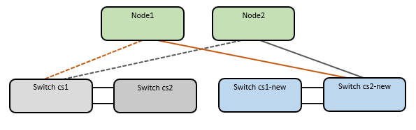

= Rever os requisitos
:allow-uri-read: 

== Rever os requisitos

Certifique-se de que:

* Você verificou o número de série do switch para garantir que o switch correto seja migrado.
* Algumas das portas nos switches Nexus 9336C-FX2 estão configuradas para serem executadas em 10GbE ou 40GbE.
* A conectividade 10GbE GbE e 40GbE de nós para switches de cluster Nexus 9336C-FX2 foi planejada, migrada e documentada.
* O cluster está totalmente funcionando (não deve haver erros nos logs ou problemas semelhantes).
* A personalização inicial dos switches Cisco Nexus 9336C-FX2 está concluída, de modo que:
+
** Os switches 9336C-FX2 estão executando a versão mais recente recomendada do software.
** Confirme se os arquivos de configuração de referência (RCFs) foram totalmente aplicados a quaisquer novos switches antes de migrar os LIFs para os novos switches.
** Verifique as configurações de execução e inicialização em ambos os switches antes de mudar o tráfego de rede.
** Qualquer personalização de site, como DNS, NTP, SMTP, SNMP e SSH, é configurada nos novos switches.

* Você tem acesso à tabela de compatibilidade de switch na https://mysupport.netapp.com/site/info/cisco-ethernet-switch["Switches Ethernet Cisco"^] página para as versões ONTAP, NX-os e RCF suportadas.
* Você analisou o software apropriado e os guias de atualização disponíveis no site da Cisco para obter os procedimentos de atualização e downgrade do switch Cisco na https://www.cisco.com/c/en/us/support/switches/nexus-9000-series-switches/series.html["Suporte para switches Cisco Nexus 9000 Series"^] página.

NOTE: Se você estiver alterando a velocidade da porta das portas de cluster e0a e e1a em sistemas AFF A800 ou AFF C800, você pode observar pacotes mal formados sendo recebidos após a conversão de velocidade. Consulte  https://mysupport.netapp.com/site/bugs-online/product/ONTAP/BURT/1570339["Erro 1570339"^] e o artigo da base de dados de Conhecimento https://kb.netapp.com/onprem/ontap/hardware/CRC_errors_on_T6_ports_after_converting_from_40GbE_to_100GbE["Erros de CRC em portas T6 após a conversão de 40GbE para 100GbE"^] para obter orientação.

== Migrar os switches

.Sobre os exemplos
Os exemplos neste procedimento usam dois nós. Esses nós usam duas portas de interconexão de cluster 10GbE e0a e e0b. Consulte https://hwu.netapp.com/["Hardware Universe"^] para verificar as portas de cluster corretas nas suas plataformas.

NOTE: As saídas de comando podem variar dependendo das diferentes versões do ONTAP.

Os exemplos deste procedimento utilizam a seguinte nomenclatura de switch e nó:

* Os nomes dos dois switches Cisco existentes são *CS1* e *CS2*
* Os novos switches de cluster Nexus 9336C-FX2 são *CS1-novo* e *CS2-novo*.
* Os nomes dos nós são *node1* e *node2*.
* Os nomes de LIF do cluster são *node1_clus1* e *node1_clus2* para o nó 1 e *node2_clus1* e *node2_clus2* para o nó 2.
* O prompt *cluster1::*>* indica o nome do cluster.

Durante este procedimento, consulte o seguinte exemplo:

image::../media/Initial_setup.png[Configuração inicial do interrutor]

.Sobre esta tarefa
O procedimento requer o uso de comandos e comandos ONTAP https://www.cisco.com/c/en/us/support/switches/nexus-9000-series-switches/series.html["Switches Nexus 9000 Series"^]; comandos ONTAP são usados, salvo indicação em contrário.

Este procedimento abrange o seguinte cenário:

* O interrutor CS2 é substituído pelo interrutor CS2-novo primeiro.
+
** Encerre as portas para os nós de cluster. Todas as portas devem ser fechadas simultaneamente para evitar a instabilidade do cluster.
+
*** Todas as LIFs de cluster fazem failover para o novo switch CS2-novo.

** O cabeamento entre os nós e o CS2 é desconetado do CS2 e reconetado ao CS2 novo.

* O interrutor CS1 é substituído pelo interrutor CS1-novo.
+
** Encerre as portas para os nós de cluster. Todas as portas devem ser fechadas simultaneamente para evitar a instabilidade do cluster.
+
*** Todas as LIFs de cluster fazem failover para o novo switch CS1-novo.

** O cabeamento entre os nós e o CS1 é desconetado do CS1 e reconetado ao CS1 novo.

NOTE: Não é necessária qualquer ligação entre interrutores (ISL) operacional durante este procedimento. Isso é feito por design porque as alterações na versão do RCF podem afetar temporariamente a conetividade do ISL. Para garantir operações de cluster sem interrupções, o procedimento a seguir faz failover de todas as LIFs de cluster para o switch de parceiro operacional enquanto executa as etapas no switch de destino.

=== Passo 1: Prepare-se para a migração

. Se o AutoSupport estiver ativado neste cluster, suprimir a criação automática de casos invocando uma mensagem AutoSupport: `system node autosupport invoke -node * -type all -message MAINT=xh`
+
onde _x_ é a duração da janela de manutenção em horas.

+

NOTE: A mensagem AutoSupport notifica o suporte técnico desta tarefa de manutenção para que a criação automática de casos seja suprimida durante a janela de manutenção.

. Altere o nível de privilégio para avançado, inserindo *y* quando solicitado a continuar:
+
`set -privilege advanced`

+
É apresentado o aviso avançado (*>).

=== Etapa 2: Configurar portas e cabeamento

. Nos novos switches, confirme se o ISL está cabeado e funcionando entre os switches CS1-novo e CS2-novo:
+
`show port-channel summary`

+
.Mostrar exemplo
[%collapsible]
====
[listing, subs="+quotes"]
----
cs1-new# *show port-channel summary*
Flags:  D - Down        P - Up in port-channel (members)
        I - Individual  H - Hot-standby (LACP only)
        s - Suspended   r - Module-removed
        b - BFD Session Wait
        S - Switched    R - Routed
        U - Up (port-channel)
        p - Up in delay-lacp mode (member)
        M - Not in use. Min-links not met
--------------------------------------------------------------------------------
Group Port-       Type     Protocol  Member Ports
      Channel
--------------------------------------------------------------------------------
1     Po1(SU)     Eth      LACP      Eth1/35(P)   Eth1/36(P)

cs2-new# *show port-channel summary*
Flags:  D - Down        P - Up in port-channel (members)
        I - Individual  H - Hot-standby (LACP only)
        s - Suspended   r - Module-removed
        b - BFD Session Wait
        S - Switched    R - Routed
        U - Up (port-channel)
        p - Up in delay-lacp mode (member)
        M - Not in use. Min-links not met
--------------------------------------------------------------------------------
Group Port-       Type     Protocol  Member Ports
      Channel
--------------------------------------------------------------------------------
1     Po1(SU)     Eth      LACP      Eth1/35(P)   Eth1/36(P)
----
====
. Exiba as portas do cluster em cada nó conetado aos switches do cluster existentes:
+
`network device-discovery show`

+
.Mostrar exemplo
[%collapsible]
====
[listing, subs="+quotes"]
----
cluster1::*> *network device-discovery show -protocol cdp*
Node/       Local  Discovered
Protocol    Port   Device (LLDP: ChassisID)  Interface         Platform
----------- ------ ------------------------- ----------------  ----------------
node1      /cdp
            e0a    cs1                       Ethernet1/1        N5K-C5596UP
            e0b    cs2                       Ethernet1/2        N5K-C5596UP
node2      /cdp
            e0a    cs1                       Ethernet1/1        N5K-C5596UP
            e0b    cs2                       Ethernet1/2        N5K-C5596UP
----
====
. Determine o status administrativo ou operacional de cada porta de cluster.
+
.. Verifique se todas as portas do cluster estão ativas com um status de integridade:
+
`network port show -ipspace Cluster`

+
.Mostrar exemplo
[%collapsible]
====
[listing, subs="+quotes"]
----
cluster1::*> *network port show -ipspace Cluster*

Node: node1
                                                                       Ignore
                                                  Speed(Mbps) Health   Health
Port      IPspace      Broadcast Domain Link MTU  Admin/Oper  Status   Status
--------- ------------ ---------------- ---- ---- ----------- -------- ------
e0a       Cluster      Cluster          up   9000  auto/10000 healthy  false
e0b       Cluster      Cluster          up   9000  auto/10000 healthy  false

Node: node2
                                                                       Ignore
                                                  Speed(Mbps) Health   Health
Port      IPspace      Broadcast Domain Link MTU  Admin/Oper  Status   Status
--------- ------------ ---------------- ---- ---- ----------- -------- ------
e0a       Cluster      Cluster          up   9000  auto/10000 healthy  false
e0b       Cluster      Cluster          up   9000  auto/10000 healthy  false
----
====
.. Verifique se todas as interfaces de cluster (LIFs) estão em suas portas iniciais:
+
`network interface show -vserver Cluster`

+
.Mostrar exemplo
[%collapsible]
====
[listing, subs="+quotes"]
----
cluster1::*> *network interface show -vserver Cluster*

            Logical      Status     Network            Current     Current Is
Vserver     Interface    Admin/Oper Address/Mask       Node        Port    Home
----------- -----------  ---------- ------------------ ----------- ------- ----
Cluster
            node1_clus1  up/up      169.254.209.69/16  node1       e0a     true
            node1_clus2  up/up      169.254.49.125/16  node1       e0b     true
            node2_clus1  up/up      169.254.47.194/16  node2       e0a     true
            node2_clus2  up/up      169.254.19.183/16  node2       e0b     true
----
====
.. Verifique se o cluster exibe informações para ambos os switches do cluster:
+
`system cluster-switch show -is-monitoring-enabled-operational true`

+
.Mostrar exemplo
[%collapsible]
====
[listing, subs="+quotes"]
----
cluster1::*> *system cluster-switch show -is-monitoring-enabled-operational true*
Switch                      Type               Address          Model
--------------------------- ------------------ ---------------- ---------------
cs1                         cluster-network    10.233.205.92    N5K-C5596UP
      Serial Number: FOXXXXXXXGS
       Is Monitored: true
             Reason: None
   Software Version: Cisco Nexus Operating System (NX-OS) Software, Version
                     9.3(4)
     Version Source: CDP

cs2                         cluster-network     10.233.205.93   N5K-C5596UP
      Serial Number: FOXXXXXXXGD
       Is Monitored: true
             Reason: None
   Software Version: Cisco Nexus Operating System (NX-OS) Software, Version
                     9.3(4)
     Version Source: CDP
----
====

. [[step_4]]Desativar reversão automática nos LIFs do cluster.
+
Ao desativar a reversão automática para este procedimento, as LIFs do cluster não serão automaticamente movidas de volta para sua porta inicial. Eles permanecem na porta atual enquanto continua a estar operacional.

+
`network interface modify -vserver Cluster -lif * -auto-revert false`

+

NOTE: A desativação da reversão automática garante que o ONTAP somente falhe sobre as LIFs do cluster quando as portas do switch são desativadas mais tarde.

. No switch de cluster CS2, encerre as portas conetadas às portas de cluster de *todos* os nós para fazer failover dos LIFs de cluster:
+
[listing, subs="+quotes"]
----
cs2# *configure*
cs2(config)# *interface eth1/1-1/2*
cs2(config-if-range)# *shutdown*
cs2(config-if-range)# *exit*
cs2(config)# *exit*
cs2#
----
. Verifique se as LIFs de cluster falharam para as portas hospedadas no switch de cluster CS1. Isso pode levar alguns segundos.
+
`network interface show -vserver Cluster`

+
.Mostrar exemplo
[%collapsible]
====
[listing, subs="+quotes"]
----
cluster1::*> *network interface show -vserver Cluster*
            Logical       Status     Network            Current    Current Is
Vserver     Interface     Admin/Oper Address/Mask       Node       Port    Home
----------- ------------- ---------- ------------------ ---------- ------- ----
Cluster
            node1_clus1   up/up      169.254.3.4/16     node1      e0a     true
            node1_clus2   up/up      169.254.3.5/16     node1      e0a     false
            node2_clus1   up/up      169.254.3.8/16     node2      e0a     true
            node2_clus2   up/up      169.254.3.9/16     node2      e0a     false
----
====
. Verifique se o cluster está em bom estado:
+
`cluster show`

+
.Mostrar exemplo
[%collapsible]
====
[listing, subs="+quotes"]
----
cluster1::*> cluster show
Node       Health  Eligibility   Epsilon
---------- ------- ------------- -------
node1      true    true          false
node2      true    true          false
----
====
. Se as LIFs de cluster tiverem falhado ao switch CS1 e o cluster estiver em bom estado, vá para <<step_10,Passo. 10>>. Se algumas LIFs de cluster não estiverem íntegras ou se o cluster não estiver saudável, você poderá reverter a conetividade para o switch CS2, da seguinte forma:
+
.. Abra as portas conetadas às portas de cluster de *todos* os nós:
+
[listing, subs="+quotes"]
----
cs2# *configure*
cs2(config)# *interface eth1/1-1/2*
cs2(config-if-range)# *no shutdown*
cs2(config-if-range)# *exit*
cs2(config)# *exit*
cs2#
----
.. Verifique se as LIFs de cluster falharam para as portas hospedadas no switch de cluster CS1. Isso pode levar alguns segundos.
+
`network interface show -vserver Cluster`

+
.Mostrar exemplo
[%collapsible]
====
[listing, subs="+quotes"]
----
cluster1::*> *network interface show -vserver Cluster*
            Logical       Status     Network            Current    Current Is
Vserver     Interface     Admin/Oper Address/Mask       Node       Port    Home
----------- ------------- ---------- ------------------ ---------- ------- ----
Cluster
            node1_clus1   up/up      169.254.3.4/16     node1      e0a     true
            node1_clus2   up/up      169.254.3.5/16     node1      e0a     false
            node2_clus1   up/up      169.254.3.8/16     node2      e0a     true
            node2_clus2   up/up      169.254.3.9/16     node2      e0a     false
----
====
.. Verifique se o cluster está em bom estado:
+
`cluster show`

+
.Mostrar exemplo
[%collapsible]
====
[listing, subs="+quotes"]
----
cluster1::*> cluster show
Node       Health  Eligibility   Epsilon
---------- ------- ------------- -------
node1      true    true          false
node2      true    true          false
----
====

. Depois de restaurar o LIF e a integridade do cluster, reinicie o processo a partir <<step_4,Passo. 4>>do .
. [[STEP_10]]mova todos os cabos de conexão de nó do cluster do antigo switch CS2 para o novo switch de CS2 novos.
+
*Os cabos de conexão do nó de cluster foram movidos para o switch de CS2 novo*

+

. Confirme a integridade das conexões de rede movidas para CS2-new:
+
`network port show -ipspace Cluster`

+
.Mostrar exemplo
[%collapsible]
====
[listing, subs="+quotes"]
----
cluster1::*> *network port show -ipspace Cluster*

Node: node1
                                                                       Ignore
                                                  Speed(Mbps) Health   Health
Port      IPspace      Broadcast Domain Link MTU  Admin/Oper  Status   Status
--------- ------------ ---------------- ---- ---- ----------- -------- ------
e0a       Cluster      Cluster          up   9000  auto/10000 healthy  false
e0b       Cluster      Cluster          up   9000  auto/10000 healthy  false

Node: node2
                                                                       Ignore
                                                  Speed(Mbps) Health   Health
Port      IPspace      Broadcast Domain Link MTU  Admin/Oper  Status   Status
--------- ------------ ---------------- ---- ---- ----------- -------- ------
e0a       Cluster      Cluster          up   9000  auto/10000 healthy  false
e0b       Cluster      Cluster          up   9000  auto/10000 healthy  false
----
====
+
Todas as portas de cluster que foram movidas devem estar para cima.

. Verifique as informações do vizinho nas portas do cluster:
+
`network device-discovery show -protocol cdp`

+
.Mostrar exemplo
[%collapsible]
====
[listing, subs="+quotes"]
----
cluster1::*> *network device-discovery show -protocol cdp*

Node/       Local  Discovered
Protocol    Port   Device (LLDP: ChassisID)  Interface      Platform
----------- ------ ------------------------- -------------  --------------
node1      /cdp
            e0a    cs1                       Ethernet1/1    N5K-C5596UP
            e0b    cs2-new                   Ethernet1/1/1  N9K-C9336C-FX2

node2      /cdp
            e0a    cs1                       Ethernet1/2    N5K-C5596UP
            e0b    cs2-new                   Ethernet1/1/2  N9K-C9336C-FX2
----
====
+
Verifique se as portas do cluster movidas veem o switch CS2-novo como vizinho.

. Confirme as conexões da porta do switch a partir da perspetiva do switch CS2-novo:
+
[listing, subs="+quotes"]
----
cs2-new# *show interface brief*
cs2-new# *show cdp neighbors*
----
. No switch de cluster CS1, encerre as portas conetadas às portas de cluster de *todos* os nós para fazer failover dos LIFs de cluster.
+
[listing, subs="+quotes"]
----
cs1# *configure*
cs1(config)# *interface eth1/1-1/2*
cs1(config-if-range)# *shutdown*
cs1(config-if-range)# *exit*
cs1(config)# *exit*
cs1#
----
+
Todas as LIFs de cluster fazem failover para o switch de CS2 novos.

. Verifique se as LIFs de cluster falharam para as portas hospedadas no switch CS2-novo. Isso pode levar alguns segundos:
+
`network interface show -vserver Cluster`

+
.Mostrar exemplo
[%collapsible]
====
[listing, subs="+quotes"]
----
cluster1::*> *network interface show -vserver Cluster*
            Logical      Status     Network            Current     Current Is
Vserver     Interfac     Admin/Oper Address/Mask       Node        Port    Home
----------- ------------ ---------- ------------------ ----------- ------- ----
Cluster
            node1_clus1  up/up      169.254.3.4/16     node1       e0b     false
            node1_clus2  up/up      169.254.3.5/16     node1       e0b     true
            node2_clus1  up/up      169.254.3.8/16     node2       e0b     false
            node2_clus2  up/up      169.254.3.9/16     node2       e0b     true
----
====
. Verifique se o cluster está em bom estado:
+
`cluster show`

+
.Mostrar exemplo
[%collapsible]
====
[listing, subs="+quotes"]
----
cluster1::*> *cluster show*
Node       Health  Eligibility   Epsilon
---------- ------- ------------- -------
node1      true    true          false
node2      true    true          false
----
====
. Mova os cabos de conexão do nó do cluster de CS1 para o novo switch de CS1 novos.
+
*Os cabos de conexão do nó de cluster foram movidos para o switch de CS1 novo*

+
image::../media/new_switch_cs2.png[Os cabos de conexão do nó do cluster foram movidos para o switch de CS1 novo]

. Confirme a integridade das conexões de rede movidas para CS1-new:
+
`network port show -ipspace Cluster`

+
.Mostrar exemplo
[%collapsible]
====
[listing, subs="+quotes"]
----
cluster1::*> *network port show -ipspace Cluster*

Node: node1
                                                                       Ignore
                                                  Speed(Mbps) Health   Health
Port      IPspace      Broadcast Domain Link MTU  Admin/Oper  Status   Status
--------- ------------ ---------------- ---- ---- ----------- -------- ------
e0a       Cluster      Cluster          up   9000  auto/10000 healthy  false
e0b       Cluster      Cluster          up   9000  auto/10000 healthy  false

Node: node2
                                                                       Ignore
                                                  Speed(Mbps) Health   Health
Port      IPspace      Broadcast Domain Link MTU  Admin/Oper  Status   Status
--------- ------------ ---------------- ---- ---- ----------- -------- ------
e0a       Cluster      Cluster          up   9000  auto/10000 healthy  false
e0b       Cluster      Cluster          up   9000  auto/10000 healthy  false
----
====
+
Todas as portas de cluster que foram movidas devem estar para cima.

. Verifique as informações do vizinho nas portas do cluster:
+
`network device-discovery show`

+
.Mostrar exemplo
[%collapsible]
====
[listing, subs="+quotes"]
----
cluster1::*> *network device-discovery show -protocol cdp*
Node/       Local  Discovered
Protocol    Port   Device (LLDP: ChassisID)  Interface       Platform
----------- ------ ------------------------- --------------  --------------
node1      /cdp
            e0a    cs1-new                   Ethernet1/1/1   N9K-C9336C-FX2
            e0b    cs2-new                   Ethernet1/1/2   N9K-C9336C-FX2

node2      /cdp
            e0a    cs1-new                   Ethernet1/1/1   N9K-C9336C-FX2
            e0b    cs2-new                   Ethernet1/1/2   N9K-C9336C-FX2
----
====
+
Verifique se as portas do cluster movidas veem o switch CS1-novo como vizinho.

. Confirme as conexões da porta do switch a partir da perspetiva do switch CS1-novo:
+
[listing, subs="+quotes"]
----
cs1-new# *show interface brief*
cs1-new# *show cdp neighbors*
----
. Verifique se o ISL entre CS1-novo e CS2-novo ainda está operacional:
+
`show port-channel summary`

+
.Mostrar exemplo
[%collapsible]
====
[listing, subs="+quotes"]
----
cs1-new# *show port-channel summary*
Flags:  D - Down        P - Up in port-channel (members)
        I - Individual  H - Hot-standby (LACP only)
        s - Suspended   r - Module-removed
        b - BFD Session Wait
        S - Switched    R - Routed
        U - Up (port-channel)
        p - Up in delay-lacp mode (member)
        M - Not in use. Min-links not met
--------------------------------------------------------------------------------
Group Port-       Type     Protocol  Member Ports
      Channel
--------------------------------------------------------------------------------
1     Po1(SU)     Eth      LACP      Eth1/35(P)   Eth1/36(P)

cs2-new# *show port-channel summary*
Flags:  D - Down        P - Up in port-channel (members)
        I - Individual  H - Hot-standby (LACP only)
        s - Suspended   r - Module-removed
        b - BFD Session Wait
        S - Switched    R - Routed
        U - Up (port-channel)
        p - Up in delay-lacp mode (member)
        M - Not in use. Min-links not met
--------------------------------------------------------------------------------
Group Port-       Type     Protocol  Member Ports
      Channel
--------------------------------------------------------------------------------
1     Po1(SU)     Eth      LACP      Eth1/35(P)   Eth1/36(P)
----
====

=== Etapa 3: Verifique a configuração

. Ative a reversão automática nos LIFs do cluster.
+
`network interface modify -vserver Cluster -lif * -auto-revert true`

. Verifique se os LIFs de cluster reverteram para suas portas residenciais (isso pode levar um minuto):
+
`network interface show -vserver Cluster`

+
Se os LIFs de cluster não tiverem revertido para sua porta inicial, reverta-os manualmente:

+
`network interface revert -vserver Cluster -lif *`

. Verifique se o cluster está em bom estado:
+
`cluster show`

. Verifique a conectividade das interfaces de cluster remotas:

[role="tabbed-block"]
====
.ONTAP 9.9,1 e posterior
--
Você pode usar o `network interface check cluster-connectivity` comando para iniciar uma verificação de acessibilidade para conetividade de cluster e, em seguida, exibir os detalhes:

`network interface check cluster-connectivity start` e `network interface check cluster-connectivity show`

[listing, subs="+quotes"]
----
cluster1::*> *network interface check cluster-connectivity start*
----
*NOTA:* espere alguns segundos antes de executar o `show` comando para exibir os detalhes.

[listing, subs="+quotes"]
----
cluster1::*> *network interface check cluster-connectivity show*
                                  Source          Destination       Packet
Node   Date                       LIF             LIF               Loss
------ -------------------------- --------------- ----------------- -----------
node1
       3/5/2022 19:21:18 -06:00   node1_clus2      node2_clus1      none
       3/5/2022 19:21:20 -06:00   node1_clus2      node2_clus2      none

node2
       3/5/2022 19:21:18 -06:00   node2_clus2      node1_clus1      none
       3/5/2022 19:21:20 -06:00   node2_clus2      node1_clus2      none
----
--
.Todos os lançamentos do ONTAP
--
Para todas as versões do ONTAP, você também pode usar o `cluster ping-cluster -node <name>` comando para verificar a conetividade:

`cluster ping-cluster -node <name>`

[listing, subs="+quotes"]
----
cluster1::*> *cluster ping-cluster -node node2*
Host is node2
Getting addresses from network interface table...
Cluster node1_clus1 169.254.209.69 node1     e0a
Cluster node1_clus2 169.254.49.125 node1     e0b
Cluster node2_clus1 169.254.47.194 node2     e0a
Cluster node2_clus2 169.254.19.183 node2     e0b
Local = 169.254.47.194 169.254.19.183
Remote = 169.254.209.69 169.254.49.125
Cluster Vserver Id = 4294967293
Ping status:
....
Basic connectivity succeeds on 4 path(s)
Basic connectivity fails on 0 path(s)
................
Detected 9000 byte MTU on 4 path(s):
    Local 169.254.19.183 to Remote 169.254.209.69
    Local 169.254.19.183 to Remote 169.254.49.125
    Local 169.254.47.194 to Remote 169.254.209.69
    Local 169.254.47.194 to Remote 169.254.49.125
Larger than PMTU communication succeeds on 4 path(s)
RPC status:
2 paths up, 0 paths down (tcp check)
2 paths up, 0 paths down (udp check)
----
--
====
. [[step5]]se você suprimiu a criação automática de casos, reative-a invocando uma mensagem AutoSupport: `system node autosupport invoke -node * -type all -message MAINT=END`

.O que se segue?
Depois de migrar os switches, vocêlink:../switch-cshm/config-overview.html["configurar monitoramento de integridade do switch"] .
