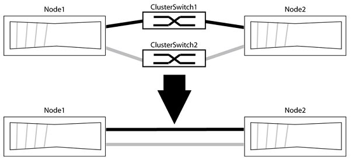

= Substituir switches de cluster Cisco Nexus 3232C por conexões sem switch
:allow-uri-read: 
:icons: font
:imagesdir: ../media/

[role="lead"]
É possível migrar de um cluster com uma rede de cluster comutada para uma em que dois nós estão conectados diretamente no ONTAP 9.3 e versões posteriores.

== Requisitos de revisão

.Diretrizes
Analise as seguintes diretrizes:

* A migração para uma configuração de cluster sem switches com dois nós é uma operação não disruptiva.  A maioria dos sistemas possui duas portas de interconexão de cluster dedicadas em cada nó, mas você também pode usar este procedimento para sistemas com um número maior de portas de interconexão de cluster dedicadas em cada nó, como quatro, seis ou oito.
* Não é possível usar o recurso de interconexão de cluster sem switch com mais de dois nós.
* Se você já possui um cluster de dois nós que utiliza switches de interconexão de cluster e está executando o ONTAP 9.3 ou posterior, pode substituir os switches por conexões diretas, ponto a ponto, entre os nós.

.Antes de começar
Certifique-se de ter o seguinte:

* Um cluster saudável consiste em dois nós conectados por switches de cluster.  Os nós devem estar executando a mesma versão do ONTAP .
* Cada nó possui o número necessário de portas de cluster dedicadas, que fornecem conexões de interconexão de cluster redundantes para suportar a configuração do seu sistema.  Por exemplo, existem duas portas redundantes para um sistema com duas portas de interconexão de cluster dedicadas em cada nó.

== Migre os switches

.Sobre esta tarefa
O procedimento a seguir remove os switches de cluster em um cluster de dois nós e substitui cada conexão com o switch por uma conexão direta com o nó parceiro.

.Sobre os exemplos
Os exemplos no procedimento a seguir mostram nós que estão usando "e0a" e "e0b" como portas de cluster.  Seus nós podem estar usando portas de cluster diferentes, pois elas variam de acordo com o sistema.

=== Etapa 1: Prepare-se para a migração

. Altere o nível de privilégio para avançado, inserindo `y` Quando solicitado a continuar:
+
`set -privilege advanced`

+
O prompt avançado `*>` aparece.

. O ONTAP 9.3 e versões posteriores suportam a detecção automática de clusters sem switch, recurso que está habilitado por padrão.
+
Você pode verificar se a detecção de clusters sem switch está habilitada executando o comando de privilégios avançados:

+
`network options detect-switchless-cluster show`

+
.Mostrar exemplo
[%collapsible]
====
O exemplo de saída a seguir mostra se a opção está habilitada.

[listing]
----
cluster::*> network options detect-switchless-cluster show
   (network options detect-switchless-cluster show)
Enable Switchless Cluster Detection: true
----
====
+
Se "Ativar detecção de cluster sem switch" estiver ativado `false` Entre em contato com o suporte da NetApp .

. Se o AutoSupport estiver ativado neste cluster, suprima a criação automática de casos invocando uma mensagem do AutoSupport :
+
`system node autosupport invoke -node * -type all -message MAINT=<number_of_hours>h`

+
onde `h` é a duração da janela de manutenção em horas.  A mensagem notifica o suporte técnico sobre essa tarefa de manutenção para que eles possam impedir a criação automática de chamados durante o período de manutenção.

+
No exemplo a seguir, o comando suprime a criação automática de casos por duas horas:

+
.Mostrar exemplo
[%collapsible]
====
[listing]
----
cluster::*> system node autosupport invoke -node * -type all -message MAINT=2h
----
====

=== Etapa 2: Configurar portas e cabos

. Organize as portas de cluster em cada switch em grupos, de forma que as portas de cluster do grupo 1 sejam conectadas ao switch de cluster 1 e as portas de cluster do grupo 2 sejam conectadas ao switch de cluster 2.  Esses grupos serão necessários mais tarde no procedimento.
. Identifique as portas do cluster e verifique o status e a integridade dos links:
+
`network port show -ipspace Cluster`

+
No exemplo a seguir, para nós com portas de cluster "e0a" e "e0b", um grupo é identificado como "node1:e0a" e "node2:e0a" e o outro grupo como "node1:e0b" e "node2:e0b".  Seus nós podem estar usando portas de cluster diferentes, pois elas variam de sistema para sistema.

+
image::../media/tnsc_clusterswitch_connections.PNG[Conexões de comutação de cluster entre o nó 1 e o nó 2]

+
Verifique se as portas têm um valor de `up` para a coluna “Link” e um valor de `healthy` para a coluna “Estado de Saúde”.

+
.Mostrar exemplo
[%collapsible]
====
[listing]
----
cluster::> network port show -ipspace Cluster
Node: node1
                                                                 Ignore
                                             Speed(Mbps) Health  Health
Port  IPspace   Broadcast Domain Link  MTU   Admin/Oper	 Status  Status
----- --------- ---------------- ----- ----- ----------- ------- -------
e0a   Cluster   Cluster          up    9000  auto/10000  healthy false
e0b   Cluster   Cluster          up    9000  auto/10000  healthy false

Node: node2
                                                                 Ignore
                                             Speed(Mbps) Health  Health
Port  IPspace   Broadcast Domain Link  MTU   Admin/Oper	 Status  Status
----- --------- ---------------- ----- ----- ----------- ------- -------
e0a   Cluster   Cluster          up    9000  auto/10000  healthy false
e0b   Cluster   Cluster          up    9000  auto/10000  healthy false
4 entries were displayed.
----
====
. Confirme se todas as LIFs do cluster estão em suas portas de origem.
+
Verifique se a coluna “is-home” está `true` para cada um dos LIFs do cluster:

+
`network interface show -vserver Cluster -fields is-home`

+
.Mostrar exemplo
[%collapsible]
====
[listing]
----
cluster::*> net int show -vserver Cluster -fields is-home
(network interface show)
vserver  lif          is-home
-------- ------------ --------
Cluster  node1_clus1  true
Cluster  node1_clus2  true
Cluster  node2_clus1  true
Cluster  node2_clus2  true
4 entries were displayed.
----
====
+
Se houver LIFs de cluster que não estejam em suas portas de origem, reverta essas LIFs para suas portas de origem:

+
`network interface revert -vserver Cluster -lif *`

. Desativar a reversão automática para as LIFs do cluster:
+
`network interface modify -vserver Cluster -lif * -auto-revert false`

. Verifique se todas as portas listadas na etapa anterior estão conectadas a um switch de rede:
+
`network device-discovery show -port _cluster_port_`

+
A coluna “Dispositivo Descoberto” deve conter o nome do switch do cluster ao qual a porta está conectada.

+
.Mostrar exemplo
[%collapsible]
====
O exemplo a seguir mostra que as portas de cluster "e0a" e "e0b" estão corretamente conectadas aos switches de cluster "cs1" e "cs2".

[listing]
----
cluster::> network device-discovery show -port e0a|e0b
  (network device-discovery show)
Node/     Local  Discovered
Protocol  Port   Device (LLDP: ChassisID)  Interface  Platform
--------- ------ ------------------------- ---------- ----------
node1/cdp
          e0a    cs1                       0/11       BES-53248
          e0b    cs2                       0/12       BES-53248
node2/cdp
          e0a    cs1                       0/9        BES-53248
          e0b    cs2                       0/9        BES-53248
4 entries were displayed.
----
====
. Verifique a conectividade das interfaces do cluster remoto:

[role="tabbed-block"]
====
.ONTAP 9.9.1 e posterior
--
Você pode usar o `network interface check cluster-connectivity` Comando para iniciar uma verificação de acessibilidade para conectividade do cluster e, em seguida, exibir os detalhes:

`network interface check cluster-connectivity start`e `network interface check cluster-connectivity show`

[listing, subs="+quotes"]
----
cluster1::*> *network interface check cluster-connectivity start*
----
*NOTA:* Aguarde alguns segundos antes de executar o `show` comando para exibir os detalhes.

[listing, subs="+quotes"]
----
cluster1::*> *network interface check cluster-connectivity show*
                                  Source           Destination      Packet
Node   Date                       LIF              LIF              Loss
------ -------------------------- ---------------- ---------------- -----------
node1
       3/5/2022 19:21:18 -06:00   node1_clus2      node2-clus1      none
       3/5/2022 19:21:20 -06:00   node1_clus2      node2_clus2      none
node2
       3/5/2022 19:21:18 -06:00   node2_clus2      node1_clus1      none
       3/5/2022 19:21:20 -06:00   node2_clus2      node1_clus2      none
----
--
.Todas as versões do ONTAP
--
Para todas as versões do ONTAP , você também pode usar o `cluster ping-cluster -node <name>` comando para verificar a conectividade:

`cluster ping-cluster -node <name>`

[listing, subs="+quotes"]
----
cluster1::*> *cluster ping-cluster -node local*
Host is node2
Getting addresses from network interface table...
Cluster node1_clus1 169.254.209.69 node1 e0a
Cluster node1_clus2 169.254.49.125 node1 e0b
Cluster node2_clus1 169.254.47.194 node2 e0a
Cluster node2_clus2 169.254.19.183 node2 e0b
Local = 169.254.47.194 169.254.19.183
Remote = 169.254.209.69 169.254.49.125
Cluster Vserver Id = 4294967293
Ping status:

Basic connectivity succeeds on 4 path(s)
Basic connectivity fails on 0 path(s)

Detected 9000 byte MTU on 4 path(s):
Local 169.254.47.194 to Remote 169.254.209.69
Local 169.254.47.194 to Remote 169.254.49.125
Local 169.254.19.183 to Remote 169.254.209.69
Local 169.254.19.183 to Remote 169.254.49.125
Larger than PMTU communication succeeds on 4 path(s)
RPC status:
2 paths up, 0 paths down (tcp check)
2 paths up, 0 paths down (udp check)
----
--
====
. [[passo 7]] Verifique se o cluster está íntegro:
+
`cluster ring show`

+
Todas as unidades devem ser mestras ou secundárias.

. Configure a configuração sem switch para as portas do grupo 1.
+

IMPORTANT: Para evitar possíveis problemas de rede, você deve desconectar as portas do grupo 1 e reconectá-las consecutivamente o mais rápido possível, por exemplo, *em menos de 20 segundos*.

+
.. Desconecte todos os cabos das portas do grupo 1 simultaneamente.
+
No exemplo a seguir, os cabos são desconectados da porta "e0a" em cada nó, e o tráfego do cluster continua através do switch e da porta "e0b" em cada nó:

+
image::../media/tnsc_clusterswitch1_disconnected.PNG[ClusterSwitch1 desconectado]

.. Conecte os cabos das portas do grupo 1 em sequência.
+
No exemplo a seguir, "e0a" no nó 1 está conectado a "e0a" no nó 2:

+
image::../media/tnsc_ports_e0a_direct_connection.PNG[Conexão direta entre as portas "e0a"]

. A opção de rede de cluster sem switch faz a transição de `false` para `true` .  Isso pode levar até 45 segundos.  Confirme se a opção sem interruptor está definida como `true` :
+
`network options switchless-cluster show`

+
O exemplo a seguir mostra que o cluster sem switch está habilitado:

+
[listing]
----
cluster::*> network options switchless-cluster show
Enable Switchless Cluster: true
----
. Verifique a conectividade das interfaces do cluster remoto:

[role="tabbed-block"]
====
.ONTAP 9.9.1 e posterior
--
Você pode usar o `network interface check cluster-connectivity` Comando para iniciar uma verificação de acessibilidade para conectividade do cluster e, em seguida, exibir os detalhes:

`network interface check cluster-connectivity start`e `network interface check cluster-connectivity show`

[listing, subs="+quotes"]
----
cluster1::*> *network interface check cluster-connectivity start*
----
*NOTA:* Aguarde alguns segundos antes de executar o `show` comando para exibir os detalhes.

[listing, subs="+quotes"]
----
cluster1::*> *network interface check cluster-connectivity show*
                                  Source           Destination      Packet
Node   Date                       LIF              LIF              Loss
------ -------------------------- ---------------- ---------------- -----------
node1
       3/5/2022 19:21:18 -06:00   node1_clus2      node2-clus1      none
       3/5/2022 19:21:20 -06:00   node1_clus2      node2_clus2      none
node2
       3/5/2022 19:21:18 -06:00   node2_clus2      node1_clus1      none
       3/5/2022 19:21:20 -06:00   node2_clus2      node1_clus2      none
----
--
.Todas as versões do ONTAP
--
Para todas as versões do ONTAP , você também pode usar o `cluster ping-cluster -node <name>` comando para verificar a conectividade:

`cluster ping-cluster -node <name>`

[listing, subs="+quotes"]
----
cluster1::*> *cluster ping-cluster -node local*
Host is node2
Getting addresses from network interface table...
Cluster node1_clus1 169.254.209.69 node1 e0a
Cluster node1_clus2 169.254.49.125 node1 e0b
Cluster node2_clus1 169.254.47.194 node2 e0a
Cluster node2_clus2 169.254.19.183 node2 e0b
Local = 169.254.47.194 169.254.19.183
Remote = 169.254.209.69 169.254.49.125
Cluster Vserver Id = 4294967293
Ping status:

Basic connectivity succeeds on 4 path(s)
Basic connectivity fails on 0 path(s)

Detected 9000 byte MTU on 4 path(s):
Local 169.254.47.194 to Remote 169.254.209.69
Local 169.254.47.194 to Remote 169.254.49.125
Local 169.254.19.183 to Remote 169.254.209.69
Local 169.254.19.183 to Remote 169.254.49.125
Larger than PMTU communication succeeds on 4 path(s)
RPC status:
2 paths up, 0 paths down (tcp check)
2 paths up, 0 paths down (udp check)
----
--
====

IMPORTANT: Antes de prosseguir para a próxima etapa, você deve aguardar pelo menos dois minutos para confirmar uma conexão back-to-back funcional no grupo 1.

. [[passo11]] Configure a configuração sem switch para as portas no grupo 2.
+

IMPORTANT: Para evitar possíveis problemas de rede, você deve desconectar as portas do grupo 2 e reconectá-las consecutivamente o mais rápido possível, por exemplo, *em menos de 20 segundos*.

+
.. Desconecte todos os cabos das portas do grupo 2 simultaneamente.
+
No exemplo a seguir, os cabos são desconectados da porta "e0b" em cada nó, e o tráfego do cluster continua através da conexão direta entre as portas "e0a":

+
image::../media/tnsc_clusterswitch2_disconnected.PNG[ClusterSwitch2 desconectado]

.. Conecte os cabos das portas do grupo 2 em sequência.
+
No exemplo a seguir, "e0a" no nó 1 está conectado a "e0a" no nó 2 e "e0b" no nó 1 está conectado a "e0b" no nó 2:

+
image::../media/tnsc_node1_and_node2_direct_connection.PNG[Conexão direta entre as portas no nó 1 e no nó 2.]

=== Etapa 3: Verifique a configuração

. Verifique se as portas em ambos os nós estão corretamente conectadas:
+
`network device-discovery show -port _cluster_port_`

+
.Mostrar exemplo
[%collapsible]
====
O exemplo a seguir mostra que as portas do cluster "e0a" e "e0b" estão corretamente conectadas à porta correspondente no parceiro do cluster:

[listing]
----
cluster::> net device-discovery show -port e0a|e0b
  (network device-discovery show)
Node/      Local  Discovered
Protocol   Port   Device (LLDP: ChassisID)  Interface  Platform
---------- ------ ------------------------- ---------- ----------
node1/cdp
           e0a    node2                     e0a        AFF-A300
           e0b    node2                     e0b        AFF-A300
node1/lldp
           e0a    node2 (00:a0:98:da:16:44) e0a        -
           e0b    node2 (00:a0:98:da:16:44) e0b        -
node2/cdp
           e0a    node1                     e0a        AFF-A300
           e0b    node1                     e0b        AFF-A300
node2/lldp
           e0a    node1 (00:a0:98:da:87:49) e0a        -
           e0b    node1 (00:a0:98:da:87:49) e0b        -
8 entries were displayed.
----
====
. Reative a reversão automática para as LIFs do cluster:
+
`network interface modify -vserver Cluster -lif * -auto-revert true`

. Verifique se todos os LIFs estão em casa. Isso pode levar alguns segundos.
+
`network interface show -vserver Cluster -lif _lif_name_`

+
.Mostrar exemplo
[%collapsible]
====
Os valores de LIF foram revertidos se a coluna “Is Home” estiver marcada. `true` , conforme mostrado para `node1_clus2` e `node2_clus2` No exemplo a seguir:

[listing]
----
cluster::> network interface show -vserver Cluster -fields curr-port,is-home
vserver  lif           curr-port is-home
-------- ------------- --------- -------
Cluster  node1_clus1   e0a       true
Cluster  node1_clus2   e0b       true
Cluster  node2_clus1   e0a       true
Cluster  node2_clus2   e0b       true
4 entries were displayed.
----
====
+
Se algum LIFS do cluster não tiver retornado às suas portas originais, reverta-os manualmente a partir do nó local:

+
`network interface revert -vserver Cluster -lif _lif_name_`

. Verifique o status do cluster dos nós no console do sistema de qualquer um dos nós:
+
`cluster show`

+
.Mostrar exemplo
[%collapsible]
====
O exemplo a seguir mostra o valor de epsilon em ambos os nós. `false` :

[listing]
----
Node  Health  Eligibility Epsilon
----- ------- ----------- --------
node1 true    true        false
node2 true    true        false
2 entries were displayed.
----
====
. Verifique a conectividade das interfaces do cluster remoto:

[role="tabbed-block"]
====
.ONTAP 9.9.1 e posterior
--
Você pode usar o `network interface check cluster-connectivity` Comando para iniciar uma verificação de acessibilidade para conectividade do cluster e, em seguida, exibir os detalhes:

`network interface check cluster-connectivity start`e `network interface check cluster-connectivity show`

[listing, subs="+quotes"]
----
cluster1::*> *network interface check cluster-connectivity start*
----
*NOTA:* Aguarde alguns segundos antes de executar o `show` comando para exibir os detalhes.

[listing, subs="+quotes"]
----
cluster1::*> *network interface check cluster-connectivity show*
                                  Source           Destination      Packet
Node   Date                       LIF              LIF              Loss
------ -------------------------- ---------------- ---------------- -----------
node1
       3/5/2022 19:21:18 -06:00   node1_clus2      node2-clus1      none
       3/5/2022 19:21:20 -06:00   node1_clus2      node2_clus2      none
node2
       3/5/2022 19:21:18 -06:00   node2_clus2      node1_clus1      none
       3/5/2022 19:21:20 -06:00   node2_clus2      node1_clus2      none
----
--
.Todas as versões do ONTAP
--
Para todas as versões do ONTAP , você também pode usar o `cluster ping-cluster -node <name>` comando para verificar a conectividade:

`cluster ping-cluster -node <name>`

[listing, subs="+quotes"]
----
cluster1::*> *cluster ping-cluster -node local*
Host is node2
Getting addresses from network interface table...
Cluster node1_clus1 169.254.209.69 node1 e0a
Cluster node1_clus2 169.254.49.125 node1 e0b
Cluster node2_clus1 169.254.47.194 node2 e0a
Cluster node2_clus2 169.254.19.183 node2 e0b
Local = 169.254.47.194 169.254.19.183
Remote = 169.254.209.69 169.254.49.125
Cluster Vserver Id = 4294967293
Ping status:

Basic connectivity succeeds on 4 path(s)
Basic connectivity fails on 0 path(s)

Detected 9000 byte MTU on 4 path(s):
Local 169.254.47.194 to Remote 169.254.209.69
Local 169.254.47.194 to Remote 169.254.49.125
Local 169.254.19.183 to Remote 169.254.209.69
Local 169.254.19.183 to Remote 169.254.49.125
Larger than PMTU communication succeeds on 4 path(s)
RPC status:
2 paths up, 0 paths down (tcp check)
2 paths up, 0 paths down (udp check)
----
--
====
. [[passo 6]] Se você desativou a criação automática de casos, reative-a invocando uma mensagem do AutoSupport :
+
`system node autosupport invoke -node * -type all -message MAINT=END`

+
Para mais informações, consulte link:https://kb.netapp.com/Advice_and_Troubleshooting/Data_Storage_Software/ONTAP_OS/How_to_suppress_automatic_case_creation_during_scheduled_maintenance_windows_-_ONTAP_9["Artigo 1010449 da Base de Conhecimento da NetApp : Como suprimir a criação automática de casos durante janelas de manutenção programadas"^].

. Altere o nível de privilégio de volta para administrador:
+
`set -privilege admin`

